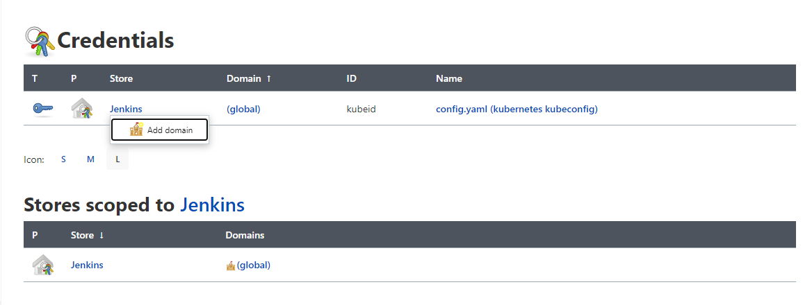
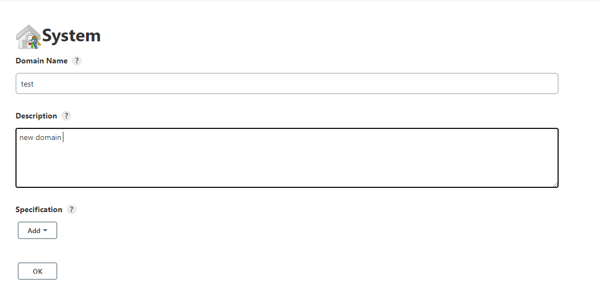
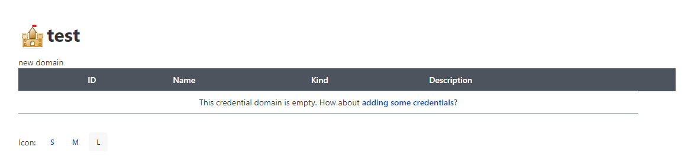
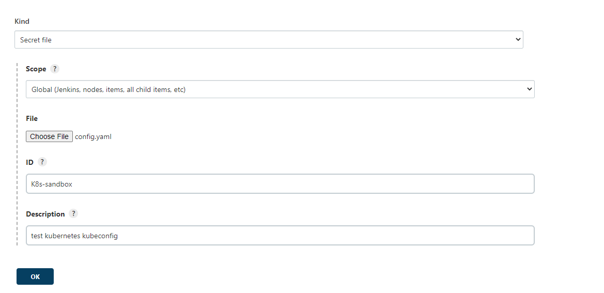
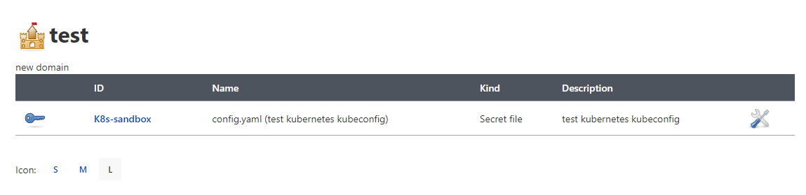
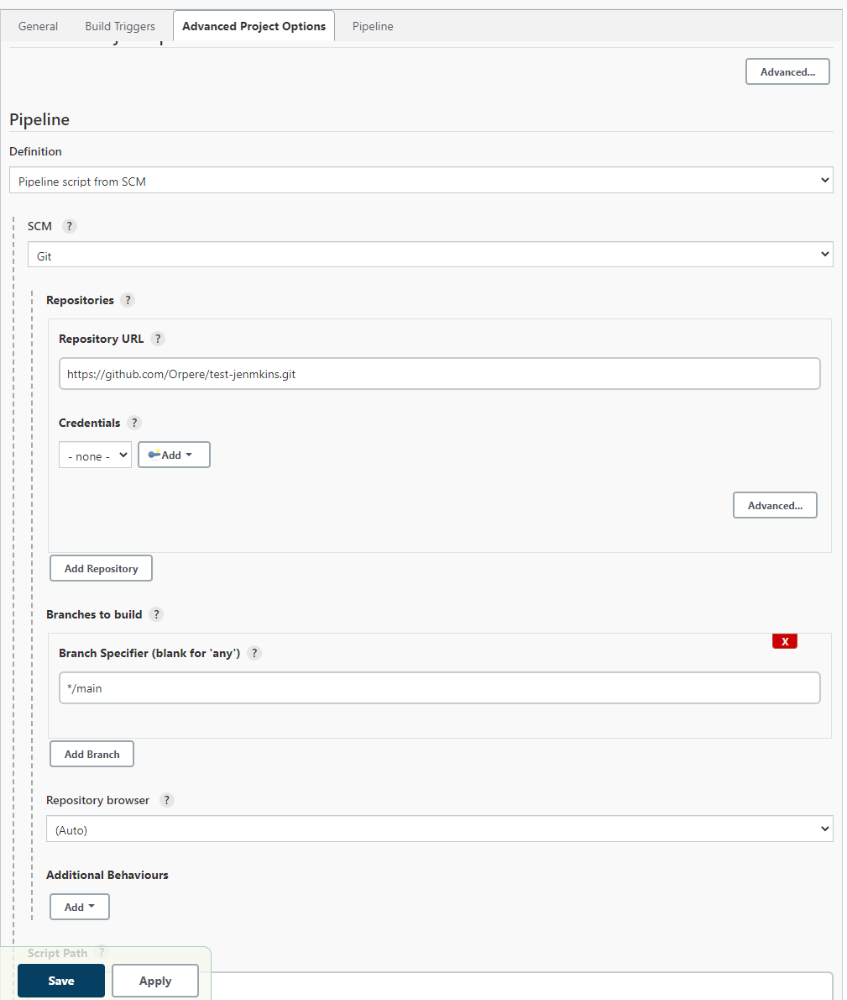

# How to Use Ansible and Kubernetes on Jenkins

1. [X] Add a secret to your jenkins credentials
2. [X] Create a Job or use a previous Job
3. [ ] Configure your jenkins file to resolve dependencies and reconise the secret
4. [ ] Configure your roles to run k8s module
5. [ ] Run the role on your job and add the secret to it

* Add a secret to your jenkins credentials
  * go to http://jemkins/credentials/
  * clic on jenkins under credentials and add a new domain if yours is not already there ad the pic bellow

    
  * Add a new domain

    
  * click on add some credentials

    
  * Add your file to the secret and fill the forms (don't forget take note of the ID is that ID you will use to call the secret on your pipelines

    

    
* Create a Job or use a previous job
  * clic on new item
  * add your job name and click on **pipeline** and then **ok**
  * on the Advanced Project Options add as suits you and check the reference bellow

    
  * save
* Configure your jenkins file to resolve dependencies and reconise the secret
