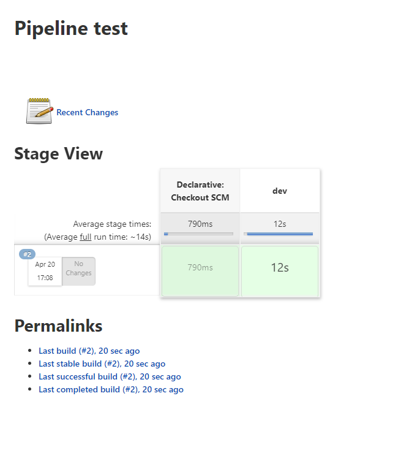

# How to Use Ansible and Kubernetes on Jenkins

1. [X] Add a secret to your jenkins credentials
2. [X] Create a Job or use a previous Job
3. [X] Configure your jenkins file to resolve dependencies and reconise the secret
4. [X] Configure your roles to run k8s module
5. [X] Run the role on your job

* Add a secret to your jenkins credentials

  * go to http://jemkins/credentials/
  * clic on jenkins under credentials and add a new domain if yours is not already there ad the pic bellow

    
  * Add a new domain

    
  * click on add some credentials

    
  * Add your file to the secret and fill the forms (don't forget take note of the ID is that ID you will use to call the secret on your pipelines

    

    
* Create a Job or use a previous job

  * clic on new item
  * add your job name and click on **pipeline** and then **ok**
  * on the Advanced Project Options add as suits you and check the reference bellow

    
  * save
* Configure your jenkins file to resolve dependencies and reconise the secret

  ```bash
  pipeline {
    agent { label 'linux' }
    environment {
     KUBECONFIG=credentials('K8s-sandbox') 
    }
    stages {
      stage('dev') {
        steps {
          sh 'sudo apt-get update'
          sh 'ansible-galaxy collection install kubernetes.core'
          sh 'ansible-galaxy collection install cloud.common'
          sh 'ansible-playbook test-playbook.yaml  --extra-vars config=$KUBECONFIG'
        }
      }
    }
  }
  ```
* Configure your roles to run k8s module

  * Look the test playbook bellow

  ```bash
  ---
  - hosts: localhost
    pre_tasks:
      - name: Install python pip3
        package:
          name:
           - python3-pip
          state: present
      - name: install requirements
        pip:
          name:
            - kubernetes
            - openshift
    collections:
      - kubernetes.core
    environment:
      - KUBECONFIG: "{{config}}"
    tasks:
      - name: Get K8S_AUTH_KUBECONFIG
        set_fact:
          k8s_auth_kubeconfig: "{{ lookup('env', 'KUBECONFIG') }}"
      - name: Get an existing Service object
        k8s_info:
          api_version: v1
          kind: Pod
        register: pod_list
      - name: Display k8s Cluster details
        debug:
          msg: "{{ pod_list }}"
  ```
* Run the role on your job

  
